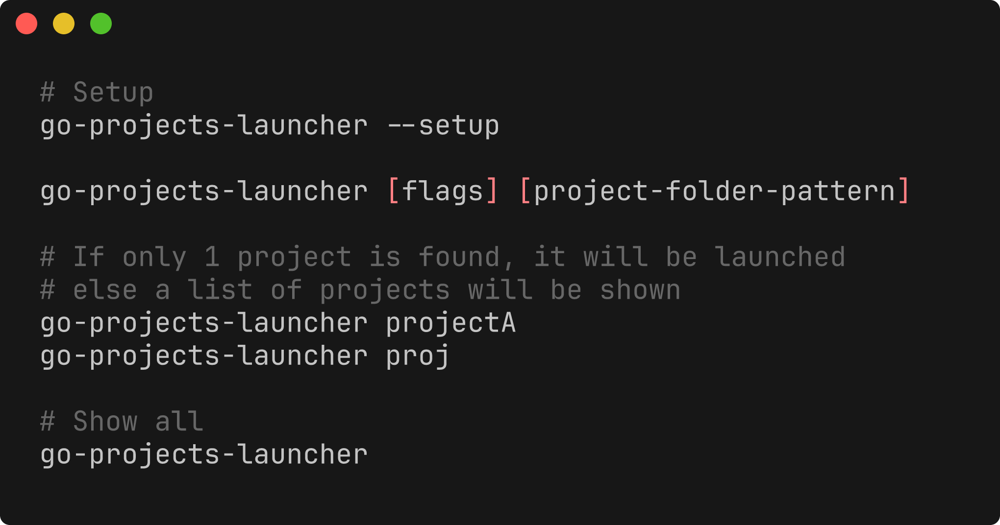

# Projects Launcher Tool

A tool for launching projects, allowing you to search all your different projects and launch them. You configure the tool with where your projects are located and it will search for them and allow you to launch them. The program that will be used to launch the project is configurable. With filters, you can dynamically filter the projects that you want to launch.

```bash
go install github.com/DaanV2/go-projects-launcher@v1.2.0
go-projects-launcher setup
```

## Examples

```bash
go-projects-launcher some-project-folder-pattern
```

## Usage



## Configuration

The config file:

```yaml
default_ide: vscode
project_folders:
  - folder: /workspaces/<user>/.home/repos
    includes: [] # regex patterns that must match
    excludes: [] # regex patterns that must not match
ide_config:
  - ide: vscode-wsl
    path_filter: wsl.localhost # regex pattern that must match to use this ide
  - ide: vscode
    path_filter: ""
  - ide: custom
    path_filter: ""
    command: notepad.exe
```

The file is stored in the users config folder -> `.projects` -> `projects-switch.yaml`

**Linux:** `/home/<user>/.config/.projects/projects-switch.yaml`  
**Windows:** `C:\Users\<user>\AppData\Roaming\.projects`  
